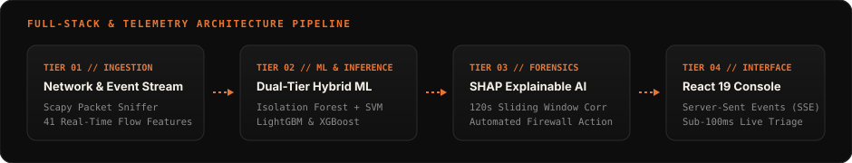
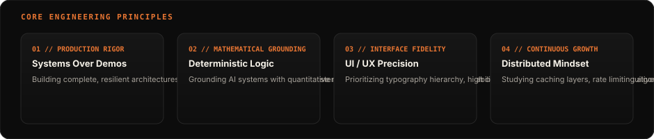

<div align="center">

<!-- Custom Animated Header Banner -->
<a href="https://github.com/arpitat09">
  
</a>

<br/>

<!-- Quick Social Links & Verified Badges -->
<p align="center">
  <a href="https://www.linkedin.com/in/arpita-tiwari-240796284/" target="_blank">
    
  </a>
  &nbsp;
  <a href="https://github.com/arpitat09" target="_blank">
    
  </a>
  &nbsp;
  <a href="https://x.com/ArpitaT2005" target="_blank">
    
  </a>
  &nbsp;
  <a href="mailto:arpitatiwari.contact@gmail.com">
    
  </a>
</p>

<!-- Interactive Developer Shell Preview -->
<p align="center">
  
</p>

</div>

<p align="center">
  
</p>

## Engineering Philosophy & Workflow

<p align="center">
   Solve -> Learn -> Ship Workflow" width="100%"/>
</p>

> *"I care about both sides of the experience — the robust backend architecture behind an application and the intuitive interface people interact with daily."*

I focus on building software that solves concrete engineering problems: from sub-second Industrial IoT intrusion detection platforms with explainable AI to deterministic financial modeling engines and real-time emergency coordination systems.

<p align="center">
  
</p>

## Full-Stack & Telemetry Pipeline

<p align="center">
  
</p>

<p align="center">
  
</p>

## About Me

- 💻 **Full-Stack Software Engineer** specializing in modern TypeScript/JavaScript, React 19, Node.js, Express, Python, and scalable databases.
- 🛡️ **Industrial IoT & Cybersecurity Focus**: Creator of **AEGIS-IIOT**, combining raw packet capture (Scapy), dual-tier machine learning (LightGBM/XGBoost), and SHAP explainability.
- 🤖 **Applied AI & Deterministic Systems**: Architecting applications with quantitative mathematical foundations rather than superficial chatbot wrappers.
- 🎨 **UI/UX & Frontend Precision**: Designing interfaces with clear typography hierarchy, high contrast themes, and minimal cognitive friction.
- 🎓 **Academic Rigor**: B.Tech in Computer Science & Engineering with deep foundations in Data Structures, Algorithms, DBMS, and Distributed Systems.
- ⚡ **Open Source & Hackathons**: Finalist contributor at **Cepheus 2.0** (Team Code Crafters) and maintainer of 15+ public engineering repositories.

<p align="center">
  
</p>

## Current Focus & Learning Roadmap

Instead of subjective percentage meters, here is what I am actively researching, testing, and implementing:

```
┌─────────────────────────────────────────────────────────────────────────────┐
│ 01 // ADVANCED REACT & WEB ARCHITECTURE                                      │
│ React 19 Actions • Optimistic UI • Concurrency • Accessible Design Systems  │
├─────────────────────────────────────────────────────────────────────────────┤
│ 02 // BACKEND ENGINEERING & OPTIMIZATION                                    │
│ Redis Caching • Rate Limiting • Connection Pooling • Server-Sent Events     │
├─────────────────────────────────────────────────────────────────────────────┤
│ 03 // SYSTEM DESIGN & DISTRIBUTED SYSTEMS                                   │
│ Load Balancing • Scalability Trade-offs • Fault Tolerance • Event Queues    │
├─────────────────────────────────────────────────────────────────────────────┤
│ 04 // AI ENGINEERING & MULTI-AGENT SYSTEMS                                  │
│ Agentic Tool Orchestration • Deterministic Math Guardrails • RAG • XAI      │
└─────────────────────────────────────────────────────────────────────────────┘
```

<p align="center">
  
</p>

## Tech Stack & Capabilities

<table>
  <tr>
    <td width="20%" valign="top"><b>Languages</b></td>
    <td width="80%">
      <code>JavaScript (ES6+)</code> &bull;
      <code>TypeScript</code> &bull;
      <code>Python</code> &bull;
      <code>C</code> &bull;
      <code>SQL</code> &bull;
      <code>HTML5</code> &bull;
      <code>CSS3</code>
    </td>
  </tr>
  <tr>
    <td valign="top"><b>Frontend</b></td>
    <td>
      <code>React 19</code> &bull;
      <code>Tailwind CSS</code> &bull;
      <code>Vite</code> &bull;
      <code>PWA</code> &bull;
      <code>Framer Motion</code> &bull;
      <code>Responsive Web Design</code>
    </td>
  </tr>
  <tr>
    <td valign="top"><b>Backend & APIs</b></td>
    <td>
      <code>Node.js</code> &bull;
      <code>Express.js</code> &bull;
      <code>Flask (Python)</code> &bull;
      <code>RESTful API Design</code> &bull;
      <code>Server-Sent Events (SSE)</code> &bull;
      <code>JWT & bcrypt</code>
    </td>
  </tr>
  <tr>
    <td valign="top"><b>Databases</b></td>
    <td>
      <code>MongoDB & Mongoose</code> &bull;
      <code>MySQL</code> &bull;
      <code>Firebase Firestore</code> &bull;
      <code>LocalStorage (Offline-first)</code>
    </td>
  </tr>
  <tr>
    <td valign="top"><b>ML & Tools</b></td>
    <td>
      <code>LightGBM</code> &bull;
      <code>XGBoost</code> &bull;
      <code>SHAP (Explainable AI)</code> &bull;
      <code>Scapy (Packet Capture)</code> &bull;
      <code>Git & GitHub</code> &bull;
      <code>Postman</code> &bull;
      <code>Vercel</code> &bull;
      <code>Render</code>
    </td>
  </tr>
  <tr>
    <td valign="top"><b>UI / UX & Design</b></td>
    <td>
      <code>Figma</code> &bull;
      <code>Wireframing & Prototyping</code> &bull;
      <code>Design Systems</code> &bull;
      <code>Web Accessibility (WCAG)</code>
    </td>
  </tr>
</table>

<p align="center">
  <a href="#"></a>
</p>

<p align="center">
  
</p>

## Selected Work & Real-World Projects

Here are highlights from my public repositories demonstrating full-stack engineering, machine learning, and product architecture:

---

### 01 // AEGIS-IIOT — Industrial IoT Intrusion Detection & Prevention System

> **AI-Powered Real-Time Industrial Cybersecurity Detection, Incident Response & Explainability Platform**

- **Problem**: Critical infrastructure networks face rapid cyber incursions where traditional firewalls lack zero-day visibility and forensic transparency.
- **Solution**: Built an enterprise IDPS combining sub-second Scapy packet capture, dual-tier hybrid machine learning (Isolation Forest + LightGBM/XGBoost), SHAP explainable AI attribution graphs, 120s sliding-window alert correlation, and asset-weighted containment firewall rules.
- **Architecture**: Raw Packet Capture (41 Flow Features) &rarr; ML Inference &rarr; SHAP Attributions &rarr; 120s Alert Correlation &rarr; Real-time SSE Telemetry &rarr; SOC Console.
- **Tech Stack**: `React 19` &bull; `Python` &bull; `Flask` &bull; `LightGBM` &bull; `XGBoost` &bull; `SHAP` &bull; `Scapy` &bull; `Vercel` &bull; `Render Cloud`

<p>
  <a href="https://aegis-iiot-frontend.vercel.app/" target="_blank">
    
  </a>
  &nbsp;
  <a href="https://github.com/arpitat09/AEGIS-IIOT" target="_blank">
    
  </a>
</p>

---

### 02 // AI Co-Founder — Startup Intelligence & Financial Engine

> **Next-Generation Startup Validation, Deterministic Scoring & 12-Month Financial Projections**

- **Problem**: Founders and angel investors waste weeks vetting startup ideas with hallucinated, generic AI advice that lacks quantitative and financial grounding.
- **Solution**: Engineered an executive startup validation engine with a deterministic 7-factor mathematical scoring model (0–100), automated TAM/SAM/SOM market models, dynamic 12-month financial forecasting (MRR, ARR, CAC payback, burn rate), and a contextual AI strategic advisor.
- **Key Capabilities**: 10-second dossier generation, interactive financial model recalculator, Challenge Mode advisor, and pitch deck exports.
- **Tech Stack**: `React 19` &bull; `TypeScript` &bull; `Vite` &bull; `Tailwind CSS` &bull; `Node.js` &bull; `Express` &bull; `Google GenAI` &bull; `Render`

<p>
  <a href="https://ai-startup-frontend-one.vercel.app/" target="_blank">
    
  </a>
  &nbsp;
  <a href="https://github.com/arpitat09/AI_Startup" target="_blank">
    
  </a>
</p>

---

### 03 // CrisisSync — Real-Time Emergency Alert & Response Platform

> **Incident Coordination & Room-Level Dynamic Floor Map System built for Cepheus 2.0 Hackathon**

- **Problem**: During building or campus emergencies, delays in alert broadcast, room localization, and responder triage create severe safety risks.
- **Solution**: Developed a real-time coordination platform with zero-friction one-tap SOS triggers, synchronized Firestore live alert streams, room-level floor plan visualization, and role-based command views for Guests, Staff, Responders, and Administrators.
- **Tech Stack**: `React` &bull; `Firebase Firestore` &bull; `Tailwind CSS` &bull; `Vercel`

<p>
  <a href="https://crisis-sync-olive.vercel.app/" target="_blank">
    
  </a>
  &nbsp;
  <a href="https://github.com/arpitat09/CrisisSync" target="_blank">
    
  </a>
</p>

---

### 04 // CareerPath AI — Career Guidance & Live Job Discovery

> **AI-Powered Career Roadmap, Automated Resume Analysis & Job Market Integration**

- **Problem**: Early-career developers struggle to bridge the gap between their current skills, target job roles, and live hiring market requirements.
- **Solution**: Architected a career guidance platform featuring automated resume parsing, AI mentorship powered by Google GenAI, and real-time job matching integrated via the Adzuna API with secure JWT authentication.
- **Tech Stack**: `React` &bull; `TypeScript` &bull; `Node.js` &bull; `Express` &bull; `MongoDB` &bull; `JWT` &bull; `Google GenAI` &bull; `Adzuna API`

<p>
  <a href="https://careerpath-ai-blush.vercel.app" target="_blank">
    
  </a>
  &nbsp;
  <a href="https://github.com/arpitat09/career-path-navigator" target="_blank">
    
  </a>
</p>

---

### 05 // MY-PLANNER (LifeOS) — Daily Habit & Task Execution PWA

> **Personal Timetable, Checklist, Alarms & Productivity Analytics Progressive Web App**

- **Problem**: Standard todo apps are cluttered and lack day-wise routine alignment, habit consistency tracking, and automated morning resets.
- **Solution**: Built an offline-first PWA with day-wise color-coded schedules, habit trackers with animated completion percentages, browser alarm reminders via Web Notifications API, and auto-reset logic.
- **Tech Stack**: `React 18` &bull; `CSS3` &bull; `LocalStorage` &bull; `Web Notifications API` &bull; `PWA` &bull; `Vercel`

<p>
  <a href="https://my-planner-xi-three.vercel.app/" target="_blank">
    
  </a>
  &nbsp;
  <a href="https://github.com/arpitat09/MY-PLANNER" target="_blank">
    
  </a>
</p>

<p align="center">
  
</p>

## Core Engineering Principles

<p align="center">
  
</p>

<p align="center">
  
</p>

## GitHub Telemetry & Stats

<div align="center">


&nbsp;


</div>

<br/>

<div align="center">


</div>

<p align="center">
  
</p>

## How I Build (Engineering Mindset)

```
01. IDENTIFY CONSTRAINT ──→ Clarify problem boundaries, throughput requirements & UX goals.
02. ARCHITECT SYSTEM    ──→ Model state transitions, data flows, and robust API schemas.
03. IMPLEMENT CLEANLY   ──→ Write modular TypeScript/Python code with strict type contracts.
04. STRESS TEST         ──→ Test latency bounds, edge cases, race conditions & error states.
05. SHIP & ITERATE      ──→ Deploy to production, monitor telemetry & refine continuously.
```

<p align="center">
  
</p>

## What I Enjoy Building

- 🌐 **Full-Stack Web Platforms**: End-to-end applications pairing performant frontends with robust backend architectures.
- 🛡️ **Industrial IoT & Cybersecurity Tools**: Network flow analyzers, real-time packet sniffers, and telemetry consoles.
- 🤖 **Applied AI & Deterministic Products**: Structured decision engines, automated research pipelines, and financial modeling tools.
- ⚡ **Real-Time Systems**: Emergency dispatch queues, SSE event streams, and live document sync applications.
- 📱 **Offline-First Productivity Apps**: High-speed PWAs with zero server latency and local-first persistence.

<p align="center">
  
</p>

## Building in Public

Most of my experiments, architectural write-ups, and learning journeys happen right here in public repositories on GitHub.

👉 **[Explore All 15+ Public Repositories on GitHub &rarr;](https://github.com/arpitat09?tab=repositories)**

<p align="center">
  
</p>

## Let's Connect & Collaborate

I am open to full-time Software Engineer / Full-Stack Developer opportunities, internships, and ambitious project collaborations.

<p align="left">
  <a href="https://www.linkedin.com/in/arpita-tiwari-240796284/" target="_blank">
    
  </a>
  &nbsp;&nbsp;
  <a href="https://github.com/arpitat09" target="_blank">
    
  </a>
  &nbsp;&nbsp;
  <a href="https://x.com/ArpitaT2005" target="_blank">
    
  </a>
  &nbsp;&nbsp;
  <a href="mailto:arpitatiwari.contact@gmail.com">
    
  </a>
</p>

<p align="center">
  
</p>

<div align="center">

<p class="mono" style="font-family: monospace; font-size: 11px; color: #78716C;">
  &copy; 2026 Arpita Tiwari &bull; Crafted with care, engineering rigor &amp; clean code.
</p>

</div>
